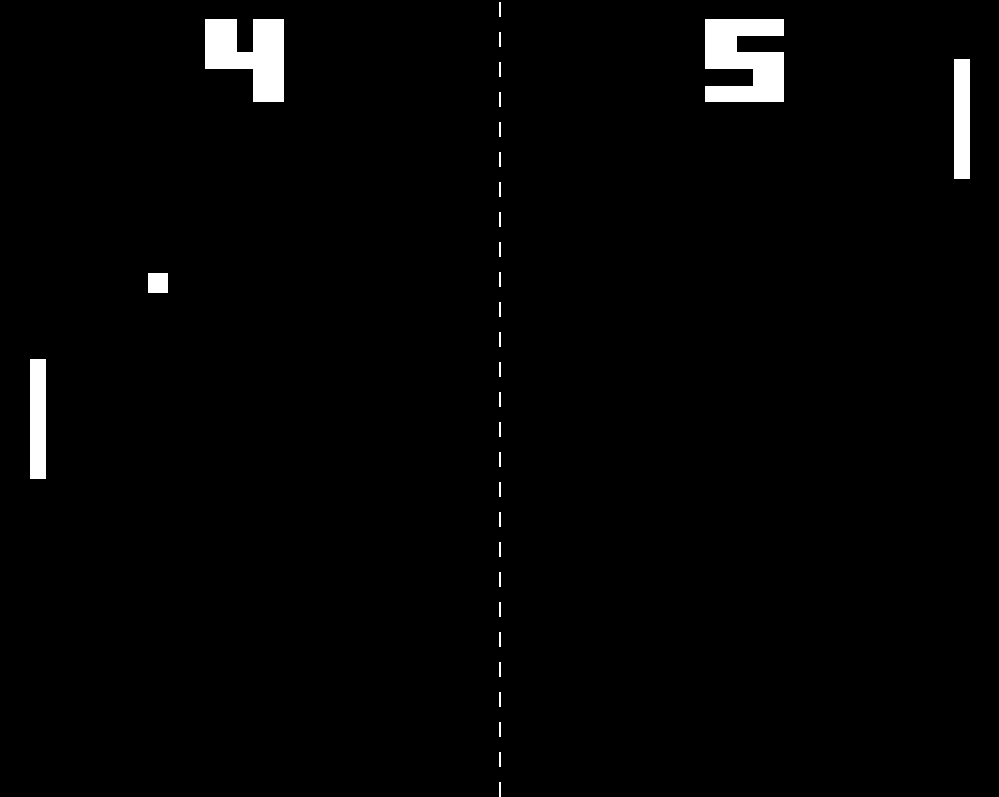

# Pong

This is an implementation of pong in Umi.

## Controls

-   W and S moves the left paddle up and down
-   The Up and Down arrow keys move the right paddle up and down
    -   The arrow keys are also used for navigating the menu
-   Enter to select an option in the menu
-   Esc to return to the menu

## Credits

`SDL2.cs` and `SDL2_ttf.cs` are from [SDL2#](https://github.com/flibitijibibo/SDL2-CS), made by Ethan Lee.

`assets/FFF_Forward.ttf` was made by Fonts For Flash and was downloaded from [here](https://www.1001fonts.com/fff-forward-font.html).
